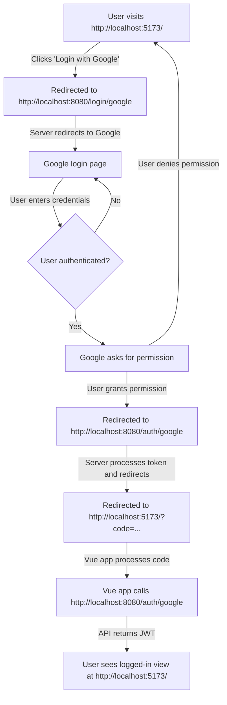

# FastAPI OAuth with Google

This project demonstrates how to implement Google OAuth authentication in a FastAPI application, with a Vue.js frontend. It includes JWT token generation for authenticated API requests.

## Features

- Google OAuth integration
- JWT token generation and validation
- Protected routes
- CORS configuration for frontend integration
- Environment variable configuration using python-dotenv

## Prerequisites

- Python 3.12+
- Poetry
- A Google Cloud Platform account with OAuth 2.0 credentials

## Installation

1. Clone the repository:
   ```
   git clone https://github.com/yourusername/fastapi-oauth-google.git
   cd fastapi-oauth-google
   ```

2. Install the required packages:
   ```
   poetry install
   ```

3. Copy `dist.env` to `.env`
   Replace the placeholder values with your actual credentials and secrets.

## Configuration

1. Go to the [Google Cloud Console](https://console.cloud.google.com/).
2. Create a new project or select an existing one.
3. Navigate to "APIs & Services" > "Credentials".
4. Create an OAuth 2.0 Client ID (Web application type).
5. Add `http://localhost:8000/auth/google` to the authorized redirect URIs.
6. Copy the Client ID and Client Secret to your `.env` file.

## Running the Application

1. Start the FastAPI server:
   ```
   uvicorn main:app --reload
   ```
   The API will be available at `http://localhost:8000`.

2. For development, you can use the built-in Swagger UI to test the API:
   Open `http://localhost:8000/docs` in your browser.

## API Endpoints

- `/login/google`: Initiates the Google OAuth flow
- `/auth/google`: Handles the OAuth callback and generates a JWT
- `/protected`: An example protected route that requires authentication

## Frontend Integration

This backend is designed to work with a Vue.js frontend. Ensure your frontend is configured to:

1. Redirect users to `/login/google` for authentication.
2. Handle the redirect back to the frontend with the JWT token.
3. Store the JWT token securely (e.g., in localStorage).
4. Send the JWT token in the Authorization header for authenticated requests.

## Security Notes

- Never commit your `.env` file or expose your secrets.
- In a production environment, use strong, unique secrets for `SESSION_SECRET_KEY` and `JWT_SECRET_KEY`.
- Implement proper error handling and logging in a production environment.
- Regularly update dependencies to patch any security vulnerabilities.

## License

This project is licensed under the MIT License.

## Auth flow

